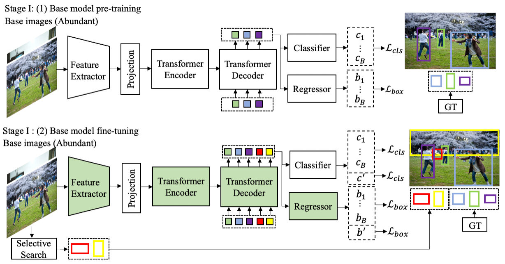
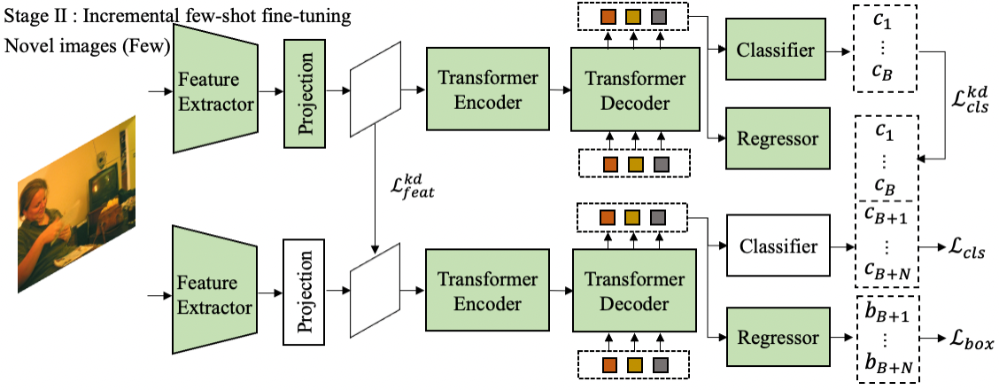

# Incremental-DETR

**About**

This is the source code of our paper:

Na Dong, Yongqiang Zhang, Mingli Ding, Gim Hee Lee. Incremental-DETR: Incremental Few-Shot Object Detection via Self-Supervised Learning. In AAAI2023.

**Abstract**
Incremental few-shot object detection aims at detecting novel classes without forgetting knowledge of the base classes with only a few labeled training data from the novel classes. Most related prior works are on incremental object detection that rely on the availability of abundant training samples per novel class that substantially limits the scalability to real-world setting where novel data can be scarce. In this paper, we propose the Incremental-DETR that does incremental few-shot object detection via fine-tuning and self-supervised learning on the DETR object detector. To alleviate severe over-fitting with few novel class data, we first fine-tune the class-specific components of DETR with self-supervision from additional object proposals generated using Selective Search as pseudo labels. We further introduce an incremental few-shot fine-tuning strategy with knowledge distillation on the class-specific components of DETR to encourage the network in detecting novel classes without forgetting the base classes. Extensive experiments conducted on standard incremental object detection and incremental few-shot object detection settings show that our approach significantly outperforms state-of-the-art methods by a large margin. 


<p align="center">
  
</p>

<p align="center">
  
</p>

For more details, please refer to [our paper](https://arxiv.org/abs/2205.04042).

```Bibtex
@article{dong2022incremental,
  title={Incremental-DETR: Incremental Few-Shot Object Detection via Self-Supervised Learning},
  author={Dong, Na and Zhang, Yongqiang and Ding, Mingli and Lee, Gim Hee},
  journal={arXiv preprint arXiv:2205.04042},
  year={2022}
}
```


## Installation

### Requirements

* Linux, CUDA>=9.2, GCC>=5.4
  
* Python>=3.7

    We recommend you to use Anaconda to create a conda environment:
    ```bash
    conda create -n deformable_detr python=3.7 pip
    ```
    Then, activate the environment:
    ```bash
    conda activate deformable_detr
    ```
  
* PyTorch>=1.5.1, torchvision>=0.6.1 (following instructions [here](https://pytorch.org/))

    For example, if your CUDA version is 9.2, you could install pytorch and torchvision as following:
    ```bash
    conda install pytorch=1.5.1 torchvision=0.6.1 cudatoolkit=9.2 -c pytorch
    ```
  
* Other requirements
    ```bash
    pip install -r requirements.txt
    ```

### Compiling CUDA operators
```bash
cd ./models/ops
sh ./make.sh
# unit test (should see all checking is True)
python test.py
```


## Usage

### Dataset preparation

Please download [COCO 2017 dataset](https://cocodataset.org/) and organize them as following:

```
code_root/
└── data/
    └── coco/
        ├── train2017/
        ├── val2017/
        └── annotations/
        	├── instances_train2017.json
        	└── instances_val2017.json
```
Please follow the instructions in [py-faster-rcnn](https://github.com/rbgirshick/py-faster-rcnn#beyond-the-demo-installation-for-training-and-testing-models) to prepare VOC datasets

Please use the codes inside ./datasets/data_preparation processing COCO and VOC datasets for incremental few-shot object detection task.


## Acknowledgements

The code is build on previous work code. If you use our code, please also consider cite:

```bibtex
@article{zhu2020deformable,
  title={Deformable DETR: Deformable Transformers for End-to-End Object Detection},
  author={Zhu, Xizhou and Su, Weijie and Lu, Lewei and Li, Bin and Wang, Xiaogang and Dai, Jifeng},
  journal={arXiv preprint arXiv:2010.04159},
  year={2020}
}
```


